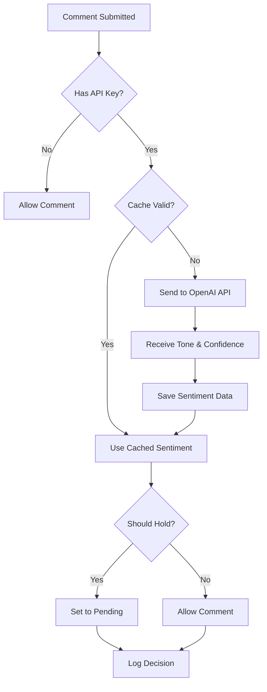

# MoodModerator – AI Comment Moderation & Tone Analysis

[](https://wordpress.org/)
[](https://php.net/)
[](http://www.gnu.org/licenses/gpl-2.0.html)

AI-powered comment sentiment analysis and automatic moderation for WordPress. Keep your community positive and healthy using OpenAI's GPT-4o-mini.

## Features

### 🤖 AI-Powered Analysis
- **Advanced Sentiment Detection** - Uses OpenAI's GPT-4o-mini for accurate tone classification
- **Hybrid Tone Approach** - Combines predefined tones (Friendly, Toxic, Sarcastic, Questioning, Angry, Neutral) with AI-suggested new tones
- **Confidence Scoring** - Each analysis includes a confidence percentage

### 🛡️ Automatic Moderation
- **Configurable Strictness Levels**:
  - **Low** - Only hold Toxic and Angry comments
  - **Medium** - Hold Toxic, Angry, and Sarcastic comments (Recommended)
  - **High** - Hold all except Friendly, Questioning, and Neutral
  - **Custom** - Choose specific tones to auto-hold
- **Smart Comment Holding** - Automatically sends negative comments to moderation queue

### 📊 Comprehensive Analytics
- **Comments Table Integration** - Tone badges directly in WordPress Comments admin
- **Posts Table Integration** - Average sentiment column for each post
- **Dashboard Widget** - 30-day sentiment summary on your WordPress dashboard
- **Post Edit Screen** - Sentiment breakdown meta box showing tone distribution

### 🔧 Advanced Features
- **Smart Caching** - Minimizes API costs by caching results (configurable duration)
- **Rate Limiting** - Built-in 100 API calls/hour limit to control costs
- **Comprehensive Logging** - Track all API calls, errors, and moderation decisions
- **Tone Filtering** - Filter comments by tone in the admin interface
- **AI Tone Suggestions** - Review and approve new tones suggested by AI
- **Detailed Metadata Viewer** - View complete analysis data for each comment

### 🌍 Developer Friendly
- **Full Internationalization** - Translation-ready with `.pot` file included
- **WordPress Coding Standards** - Follows all WP coding standards and best practices
- **Secure by Design** - Nonces, sanitization, escaping, encrypted API keys
- **No jQuery** - Pure vanilla JavaScript for better performance
- **Extensible Architecture** - Well-structured OOP code for easy customization

## Requirements

- **WordPress**: 6.0 or higher
- **PHP**: 7.4 or higher
- **OpenAI API Key**: [Get one here](https://platform.openai.com/api-keys)

## Installation

### From WordPress.org (Recommended)
1. Go to **Plugins > Add New** in your WordPress admin
2. Search for "MoodModerator"
3. Click **Install Now** and then **Activate**

### Manual Installation
1. Download the latest release from [Releases](../../releases)
2. Upload the `moodmoderator` folder to `/wp-content/plugins/`
3. Activate the plugin through the **Plugins** menu in WordPress

### From Source
```bash
git clone https://github.com/rehanadil/moodmoderator-wordpress-plugin.git
cd moodmoderator-wordpress-plugin
# Copy to WordPress plugins directory
cp -r . /path/to/wordpress/wp-content/plugins/moodmoderator/
```

## Configuration

1. **Get OpenAI API Key**
   - Sign up at [platform.openai.com](https://platform.openai.com/)
   - Navigate to **API Keys** section
   - Create a new API key

2. **Configure Plugin**
   - Go to **Settings > MoodModerator** in WordPress admin
   - Enter your OpenAI API key
   - Choose your preferred strictness level
   - Optionally adjust cache duration

3. **Test the Setup**
   - Submit a test comment on any post
   - Check **Comments** admin to see the tone badge
   - Review **Tools > MoodModerator Logs** for API activity

## Usage

### Viewing Sentiment Data

**Comments Table:**
- Navigate to **Comments** in WordPress admin
- See tone badges next to each comment
- Filter comments by tone using the dropdown

**Posts Table:**
- Navigate to **Posts** in WordPress admin
- View average sentiment in the MoodModerator column

**Dashboard Widget:**
- View 30-day sentiment summary on your dashboard
- Shows comment count per tone

**Post Edit Screen:**
- Edit any post
- See sentiment analytics in the MoodModerator meta box
- View complete tone distribution for that post's comments

### Managing Tones

1. Go to **Settings > MoodModerator**
2. Scroll to **Tone Management** section
3. Review AI-suggested tones
4. Approve or reject new tones
5. Use approved tones in Custom strictness settings

### Viewing Logs

1. Go to **Tools > MoodModerator Logs**
2. Filter by:
   - Log type (API call, error, comment held, etc.)
   - Date range
   - Search terms
3. Click **View Details** to see complete metadata

### Clearing Cache

To force re-analysis of all comments:
1. Go to **Settings > MoodModerator**
2. Click **Clear Cache** button
3. Comments will be re-analyzed on next view

## Cost Estimation

MoodModerator uses OpenAI's GPT-4o-mini model for analysis:

- **Cost per comment**: ~$0.00015 USD
- **1,000 comments**: ~$0.15 USD
- **10,000 comments**: ~$1.50 USD

The built-in caching significantly reduces costs by avoiding re-analysis of unchanged comments.

## How It Works



## Technical Details

### Architecture

```
moodmoderator/
├── admin/                          # Admin-specific functionality
│   ├── class-moodmoderator-admin.php
│   ├── class-moodmoderator-comments-table.php
│   ├── class-moodmoderator-logs.php
│   ├── class-moodmoderator-posts-table.php
│   ├── css/
│   └── partials/
├── assets/                         # Public assets
│   └── js/
│       └── moodmoderator-admin.js  # Vanilla JavaScript (no jQuery)
├── includes/                       # Core functionality
│   ├── class-moodmoderator-ai.php          # OpenAI integration
│   ├── class-moodmoderator-cache.php       # Caching logic
│   ├── class-moodmoderator-comment-handler.php
│   ├── class-moodmoderator-database.php    # Database operations
│   └── class-moodmoderator.php             # Main plugin class
├── languages/                      # Translation files
│   └── moodmoderator.pot
└── moodmoderator.php              # Plugin entry point
```

### Database Schema

**Custom Tables:**
- `wp_moodmoderator_logs` - Activity logging
- `wp_moodmoderator_tone_suggestions` - AI-suggested tones

**Comment Meta:**
- `moodmoderator_tone` - Detected tone
- `moodmoderator_confidence` - Confidence score (0-1)
- `moodmoderator_analyzed_at` - Analysis timestamp
- `moodmoderator_content_hash` - Content hash for cache validation
- `moodmoderator_ai_reasoning` - AI's reasoning (optional)

### Security Features

- ✅ API key XOR encryption with WordPress salts
- ✅ Nonce verification on all forms
- ✅ Input sanitization with `sanitize_text_field()` and `wp_unslash()`
- ✅ Output escaping with `esc_html()`, `esc_attr()`, `esc_url()`
- ✅ Prepared SQL statements via `$wpdb->prepare()`
- ✅ Capability checks for admin actions
- ✅ Rate limiting to prevent API abuse

## Privacy & Data Handling

MoodModerator sends comment text to OpenAI's API for sentiment analysis:

- **Data Sent**: Comment text and optionally post title for context
- **Data Storage**: Sentiment results stored in WordPress database
- **Third-Party Processing**: OpenAI processes comment text per their [privacy policy](https://openai.com/policies/privacy-policy)
- **Retention**: OpenAI does not store data beyond their standard retention policies

**Site owners should disclose this third-party processing in their privacy policy.**

## Contributing

Contributions are welcome! Please follow these guidelines:

1. Fork the repository
2. Create a feature branch (`git checkout -b feature/amazing-feature`)
3. Follow WordPress coding standards
4. Add appropriate phpcs comments for exceptions
5. Test thoroughly on clean WordPress install
6. Commit your changes (`git commit -m 'Add amazing feature'`)
7. Push to the branch (`git push origin feature/amazing-feature`)
8. Open a Pull Request

### Development Setup

```bash
# Clone repository
git clone https://github.com/rehanadil/moodmoderator-wordpress-plugin.git
cd moodmoderator-wordpress-plugin

# Install WordPress coding standards
composer require --dev wp-coding-standards/wpcs

# Run code sniffer
phpcs --standard=WordPress .
```

## Frequently Asked Questions

**Q: Will this work with existing comments?**
A: The plugin analyzes new comments as they're submitted. Existing comments are not automatically analyzed.

**Q: What if the OpenAI API is down?**
A: Comments will be allowed through using WordPress's default moderation rules. The plugin logs errors for debugging.

**Q: Does it work with other moderation plugins like Akismet?**
A: Yes! MoodModerator runs after Akismet (priority 11), so spam is already filtered.

**Q: Can I customize the tone categories?**
A: Yes! The plugin uses a hybrid approach. AI can suggest new tones which you can approve via Settings.

**Q: Will this slow down my site?**
A: No. API calls happen during comment submission with a 5-second timeout to ensure responsiveness.

## Roadmap

- [ ] Support for additional AI providers (Anthropic Claude, Google Gemini)
- [ ] Bulk re-analysis of existing comments
- [ ] Webhook notifications for negative comments
- [ ] Export logs to CSV
- [ ] WP-CLI commands for batch operations
- [ ] Integration with email notification plugins

## License

This plugin is licensed under the GNU General Public License v2 or later.

```
MoodModerator – AI Comment Moderation & Tone Analysis
Copyright (C) 2025 Rehan Adil

This program is free software; you can redistribute it and/or modify
it under the terms of the GNU General Public License as published by
the Free Software Foundation; either version 2 of the License, or
(at your option) any later version.

This program is distributed in the hope that it will be useful,
but WITHOUT ANY WARRANTY; without even the implied warranty of
MERCHANTABILITY or FITNESS FOR A PARTICULAR PURPOSE. See the
GNU General Public License for more details.
```

See [LICENSE.txt](LICENSE.txt) for full license text.

## Author

**Rehan Adil**
- Website: [rehanadil.dev](https://rehanadil.dev)
- GitHub: [@rehanadil](https://github.com/rehanadil)

## Support

For support, feature requests, or bug reports:

- **GitHub Issues**: [Report an issue](../../issues)
- **WordPress.org**: [Plugin Support Forum](https://wordpress.org/support/plugin/moodmoderator/)
- **Website**: [rehanadil.dev](https://rehanadil.dev)

## Acknowledgments

- Built with [OpenAI GPT-4o-mini](https://openai.com/index/gpt-4o-mini-advancing-cost-efficient-intelligence/)
- Follows [WordPress Coding Standards](https://developer.wordpress.org/coding-standards/wordpress-coding-standards/)

---

Made with ❤️ for the WordPress community
